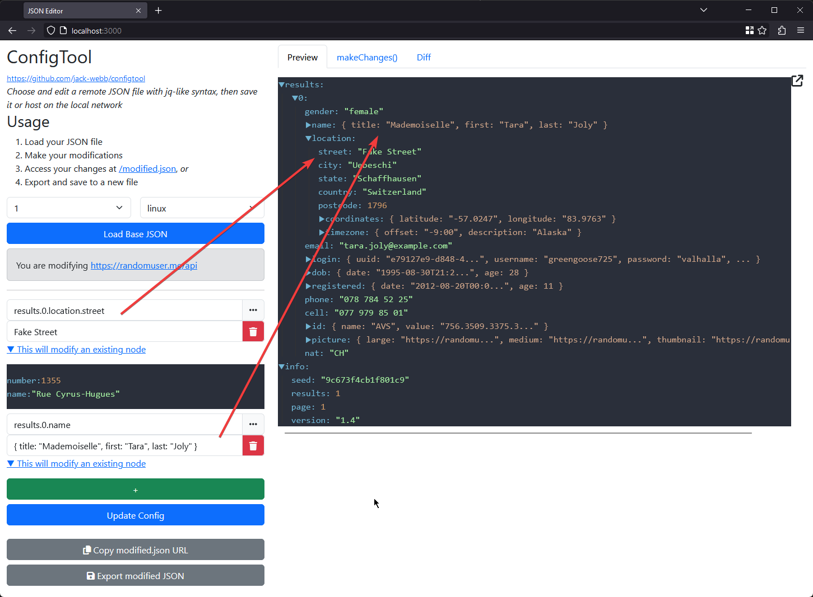

# Configtool



_Test data from https://randomuser.me/_

Choose and edit a remote JSON file with jq-like syntex, then save it or host on the local network. Built with Express.

# Usage

1. Load your JSON, selected using your parameters (see 'Set up' below).
2. Make your changes in the left-hand pane. The key should be a normal JSON accessor. The value can be a primitive or another JSON object.
3. Use the /modified.json endpoint to access your changes live (for example, mapping with a proxy like Postman or Charles), _or_
4. Save your changes and download to a new JSON file.

# Set up

Sources for JSON files are provided by `resolve.js`. Two functions must be implemented, as in the example below.

```js
/**
 * The parameters used to get different variations of your JSON. 
 * The key is the parameter name, the list are the values for the dropdown
 */
exports.getFileParameters = async function (req) {
  return {
    version: [1, 2, 3],
    environment: ["linux", "mac", "windows"],
  }
};

/**
 * Resolve the URL for the config to be edited, using the parameters from 
 * the dropdowns (or any other parameters/logic you want)
 */
exports.resolveConfigUrl = async function (params) {
  const { version, environment } = params;

  const url = `https://example.com/myFile-v${version}-${environment}.json`

  return url;
};
```

The first method provides the parameters for selecting your JSON file. The second method resolves those parameters to the URL of that JSON file. You can use any logic in either method for determining which URL to pass to the JSON loader, the parameters just allow you to select this from the frontend.

# Running Configtool

`npm -i`
`npm run app`
